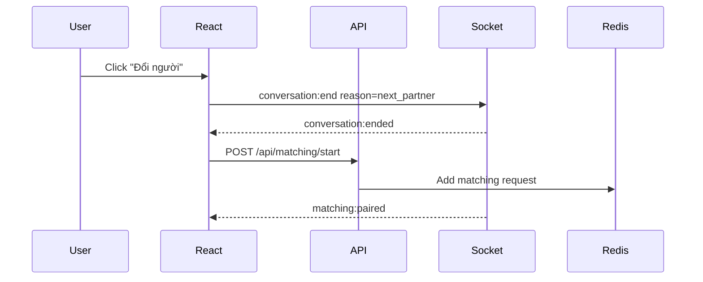

# API & Realtime Spec - Chat Ẩn Danh

## 1. Conventions

Base URL:

```text
REST:   /api
Socket: /socket.io
```

Auth:

- Access token gửi qua `Authorization: Bearer <token>`.
- Refresh token lưu bằng httpOnly secure cookie.
- Guest anonymous cũng có access token, nhưng scope hạn chế.
- Socket.IO handshake gửi token trong `auth.token`.

Response envelope:

```json
{
  "data": {},
  "meta": {},
  "error": null
}
```

Error envelope:

```json
{
  "data": null,
  "meta": {},
  "error": {
    "code": "VALIDATION_ERROR",
    "message": "Invalid request",
    "details": []
  }
}
```

Common error codes:

```text
UNAUTHORIZED
FORBIDDEN
VALIDATION_ERROR
RATE_LIMITED
SESSION_EXPIRED
MATCHING_ALREADY_IN_QUEUE
CONVERSATION_NOT_FOUND
MESSAGE_TOO_LONG
TARGET_BLOCKED
ROOM_DISABLED
PROFILE_REQUIRED
```

## 2. Shared Types

```ts
export type UserMode = "guest" | "registered" | "premium";
export type Gender = "male" | "female" | "other";
export type SessionStatus = "active" | "muted" | "banned" | "expired";
export type ConversationType = "direct" | "room";
export type MessageStatus = "sent" | "delivered" | "failed" | "hidden_by_moderation";
export type ReportReason =
  | "spam"
  | "harassment"
  | "scam"
  | "sexual_content"
  | "minor_safety"
  | "violence"
  | "privacy"
  | "other";

export interface ChatProfile {
  displayName: string;
  age: number;
  location: string;
  gender: Gender;
  desiredGenders: Gender[];
}

export interface PublicParticipant {
  participantId: string;
  alias: string;
  avatarKey: string;
  mode: UserMode;
  age?: number;
  location?: string;
  gender?: Gender;
  online: boolean;
}

export interface PublicMessage {
  id: string;
  clientMessageId?: string;
  conversationId: string;
  sender: PublicParticipant;
  body: string;
  attachment?: {
    type: "image";
    url: string;
    mimeType: "image/jpeg" | "image/png" | "image/webp" | "image/gif";
    name?: string;
    size: number;
    alt?: string;
  };
  status: MessageStatus;
  createdAt: string;
}
```

Rule: `PublicParticipant` không bao giờ chứa `userId`, `email`, `phone`, `ipHash`, `deviceHash`.

Profile rule:

- `alias` là tên hiển thị/nickname, không bắt buộc là tên thật.
- `location` chỉ là tỉnh/thành hoặc khu vực, không phải địa chỉ chính xác.
- `gender` dùng các giá trị `male`, `female`, `other`.
- `desiredGenders` nằm trong profile riêng/matching request, không bắt buộc show cho đối phương.

## 3. Auth & Session APIs

### POST /api/sessions/anonymous

Tạo guest anonymous session.

Request:

```json
{
  "preferredAlias": "AD-4827",
  "profile": {
    "displayName": "AD-4827",
    "age": 22,
    "location": "TP. Hồ Chí Minh",
    "gender": "female",
    "desiredGenders": ["male", "other"]
  },
  "ageConfirmed": true
}
```

Response:

```json
{
  "data": {
    "sessionId": "ses_123",
    "accessToken": "jwt",
    "displayAlias": "AD-4827",
    "avatarKey": "avatar_blue_03",
    "profileComplete": true,
    "expiresAt": "2026-06-26T16:00:00.000Z"
  },
  "meta": {},
  "error": null
}
```

Acceptance:

- Nếu user không nhập alias, server random alias dạng mã công khai, ví dụ `AD-4827`.
- Nếu `ageConfirmed` false và sản phẩm cấu hình 18+, trả `FORBIDDEN`.
- Không yêu cầu email/password.
- Nếu thiếu profile, server vẫn có thể tạo session nhưng `profileComplete = false`; matching sẽ trả `PROFILE_REQUIRED`.

### POST /api/auth/register

Request:

```json
{
  "email": "user@example.com",
  "password": "strong-password"
}
```

Response:

```json
{
  "data": {
    "account": {
      "id": "acc_123",
      "email": "user@example.com",
      "displayName": "AD-4827",
      "mode": "registered",
      "profileComplete": false
    },
    "accessToken": "jwt"
  },
  "meta": {},
  "error": null
}
```

Rules:

- Đăng ký email chỉ yêu cầu email/password; UI có thể yêu cầu nhập lại mật khẩu để xác nhận trước khi gọi API.
- Server tự sinh mã công khai tạm dạng `AD-4827` cho account mới.
- User vẫn phải hoàn tất profile riêng trước khi matching.
- Hash password bằng Argon2id hoặc bcrypt.
- Set refresh token bằng httpOnly cookie.
- Không trả `passwordHash`.

### POST /api/auth/login

Request:

```json
{
  "email": "user@example.com",
  "password": "strong-password"
}
```

Response giống register.

### GET /api/auth/google

Redirect user tới Google OAuth/OIDC consent screen.

Rules:

- Đây là "đăng ký/đăng nhập bằng Google/Gmail".
- App không bao giờ yêu cầu hoặc lưu mật khẩu Gmail.
- Sau callback, nếu account chưa có profile thì frontend chuyển tới `/profile/setup`.

### GET /api/auth/google/callback

Google redirect callback. Server tạo hoặc tìm account, set refresh cookie và redirect về web app.

### POST /api/auth/refresh

Đọc refresh cookie và trả access token mới.

### POST /api/auth/logout

Thu hồi refresh token hiện tại.

### POST /api/auth/link-session

Link guest session vào account sau khi user đăng ký.

Request:

```json
{
  "sessionId": "ses_123"
}
```

## 4. Profile APIs

### GET /api/me/profile

Response:

```json
{
  "data": {
    "profileComplete": true,
    "profile": {
      "displayName": "AD-4827",
      "age": 22,
      "location": "TP. Hồ Chí Minh",
      "gender": "female",
      "desiredGenders": ["male", "other"]
    }
  },
  "meta": {},
  "error": null
}
```

### PUT /api/me/profile

Create or update profile for current guest session or registered account.

Request:

```json
{
  "displayName": "AD-4827",
  "age": 22,
  "location": "TP. Hồ Chí Minh",
  "gender": "female",
  "desiredGenders": ["male", "other"]
}
```

Response:

```json
{
  "data": {
    "profileComplete": true,
    "profile": {
      "displayName": "AD-4827",
      "age": 22,
      "location": "TP. Hồ Chí Minh",
      "gender": "female",
      "desiredGenders": ["male", "other"]
    }
  },
  "meta": {},
  "error": null
}
```

Validation:

- `displayName`: 2-30 ký tự, trim, không yêu cầu tên thật.
- `age`: integer. MVP 18-99 nếu app cho phép nội dung người lớn.
- `location`: 2-80 ký tự, chỉ tỉnh/thành/khu vực, không lưu địa chỉ chính xác.
- `gender`: `male`, `female`, `other`.
- `desiredGenders`: array có ít nhất 1 giá trị trong `male`, `female`, `other`; chọn cả 3 nghĩa là tất cả.

## 5. Matching APIs

### POST /api/matching/start

Request:

```json
{
  "mode": "direct",
  "preferences": {
    "desiredGenders": ["female"],
    "strictGenderMatch": true
  }
}
```

Response:

```json
{
  "data": {
    "requestId": "match_req_123",
    "status": "queued",
    "timeoutSeconds": 60,
    "avoidRecentMatches": true
  },
  "meta": {},
  "error": null
}
```

Rules:

- Một session chỉ có một active matching request.
- Session/account phải có profile complete; nếu thiếu trả `PROFILE_REQUIRED`.
- Random match không có tìm theo chủ đề; request/response matching không có `topicId`, và server bỏ qua field này nếu client cũ gửi lên.
- Redis queue key gợi ý: `matching:direct`.
- Không match với blocked target hoặc session bị mute/ban.
- Matching phải kiểm tra gender của đối phương nằm trong `desiredGenders` của user.
- Nếu `strictGenderMatch = true`, hai bên phải cùng thỏa preference của nhau.
- Matching phải ưu tiên ứng viên chưa từng gặp trong `MATCH_HISTORY_COOLDOWN_DAYS`.
- Nếu còn ít nhất 1 ứng viên mới phù hợp, server không được chọn ứng viên đã gặp trong cooldown.
- Chỉ fallback sang người đã gặp khi không có ứng viên mới, user đã chờ quá `REMATCH_FALLBACK_SECONDS`, và pool phù hợp thấp hơn `MIN_FRESH_MATCH_POOL`.
- Block list luôn có priority cao hơn fallback; đã block thì không bao giờ ghép lại.

Candidate selection order:

```text
1. Load current request profile and trusted server-side preferences.
2. Load compatible candidates from Redis queues by profile filters.
3. Remove self, banned/muted/expired sessions and blocked pairs.
4. Split candidates into freshCandidates and repeatCandidates using match_history.
5. If freshCandidates is not empty, choose random candidate from freshCandidates.
6. If freshCandidates is empty and fallback conditions pass, choose repeat candidate with oldest last_matched_at.
7. If no candidate passes, keep queued until timeout.
```

Server config:

```text
MATCH_HISTORY_COOLDOWN_DAYS=7
REMATCH_FALLBACK_SECONDS=45
MIN_FRESH_MATCH_POOL=2
MATCH_HISTORY_RETENTION_DAYS=30
```

Implementation notes:

- Sau khi tạo direct conversation, upsert `match_history` ngay trong cùng transaction với conversation/members nếu có thể.
- Có thể cache recent matched identity keys trong Redis, ví dụ `match:recent:{identityKey}`, TTL theo cooldown, để giảm query DB khi queue lớn.
- Database vẫn là nguồn sự thật; Redis cache chỉ là tối ưu hiệu năng.

### POST /api/matching/cancel

Request:

```json
{
  "requestId": "match_req_123"
}
```

Response:

```json
{
  "data": {
    "status": "cancelled"
  },
  "meta": {},
  "error": null
}
```

## 6. Conversation & Message APIs

### GET /api/conversations/:conversationId

Trả metadata conversation và participants public.

### GET /api/conversations/:conversationId/messages

Query:

```text
?before=msg_123&limit=30
```

Response:

```json
{
  "data": {
    "items": [],
    "nextCursor": "msg_100"
  },
  "meta": {},
  "error": null
}
```

### POST /api/conversations/:conversationId/end

Kết thúc conversation.

Request:

```json
{
  "reason": "user_left"
}
```

### POST /api/conversations/:conversationId/engagement-events

Ghi nhận tương tác giữ hứng thú trong conversation.

Request:

```json
{
  "type": "question_suggestion_selected",
  "payload": {
    "question": "Một điều nhỏ gần đây làm bạn vui là gì?"
  }
}
```

Rules:

- Chỉ cho members của conversation gửi.
- User-facing payload phải là tiếng Việt.
- Không mở engagement nâng cao nếu conversation đang bị report nghiêm trọng.

## 7. Connections APIs

Phase 2 by default. Do not ship user-visible saved connections in MVP unless a feature spec and feature flag explicitly enable it.

### POST /api/connections/invite

Gửi lời mời lưu kết nối ẩn danh sau khi conversation đạt milestone.

Request:

```json
{
  "conversationId": "conv_123"
}
```

Response:

```json
{
  "data": {
    "inviteId": "conn_inv_123",
    "status": "pending"
  },
  "meta": {},
  "error": null
}
```

### POST /api/connections/:inviteId/accept

Đồng ý lưu kết nối ẩn danh.

### POST /api/connections/:inviteId/decline

Từ chối lưu kết nối. Không gửi lý do chi tiết cho người mời.

### GET /api/connections

Trả danh sách kết nối ẩn danh đã được cả hai đồng ý.

## 8. Rooms APIs

Rooms/tìm theo chủ đề không mount trong MVP hiện tại. API public không expose `/api/rooms`; random matching dùng `/api/matching/start` và chỉ xét `desiredGenders`.

## 9. Safety APIs

### POST /api/blocks

Request:

```json
{
  "conversationId": "conv_123",
  "targetParticipantId": "part_456",
  "reason": "harassment"
}
```

Response:

```json
{
  "data": {
    "blocked": true
  },
  "meta": {},
  "error": null
}
```

### GET /api/blocks

Trả block list theo public alias hoặc masked target.

### DELETE /api/blocks/:blockId

Bỏ chặn.

### POST /api/reports

Request:

```json
{
  "conversationId": "conv_123",
  "messageId": "msg_123",
  "targetParticipantId": "part_456",
  "reason": "spam",
  "note": "Gửi link liên tục"
}
```

Response:

```json
{
  "data": {
    "reportId": "rep_123",
    "status": "submitted"
  },
  "meta": {},
  "error": null
}
```

Rules:

- Cho phép report conversation không có `messageId`.
- Snapshot tối đa 20 tin nhắn gần nhất nếu policy cho phép.
- Sau khi report, user được gợi ý block và đổi người.

## 10. Admin APIs

Admin endpoints yêu cầu role `admin` hoặc `moderator`.

### GET /api/admin/reports

Query:

```text
?status=open&reason=spam&limit=50
```

### POST /api/admin/moderation-actions

Request:

```json
{
  "reportId": "rep_123",
  "targetSessionId": "ses_456",
  "action": "mute",
  "durationMinutes": 60,
  "note": "Spam repeated links"
}
```

Allowed actions:

```text
ignore
warn
mute
ban
hide_message
close_report
```

### GET /api/admin/metrics

Response:

```json
{
  "data": {
    "onlineUsers": 1200,
    "activeConversations": 410,
    "messagesLastHour": 8000,
    "openReports": 34
  },
  "meta": {},
  "error": null
}
```

## 11. Socket.IO Auth

Client connect:

```ts
const socket = io(API_URL, {
  auth: { token: accessToken },
  transports: ["websocket"]
});
```

Server rules:

- Validate token on connection.
- Reject banned/expired sessions.
- Put socket id into Redis presence.
- On disconnect, update presence after grace period 20 seconds.

## 12. Socket Events

### socket:ready

Server -> Client after auth success.

Self-context only. Do not broadcast this payload to other users.

Payload:

```json
{
  "sessionId": "ses_123",
  "socketId": "sock_123",
  "online": true
}
```

### matching:paired

Server -> Client.

```json
{
  "conversationId": "conv_123",
  "participant": {
    "participantId": "part_other",
    "alias": "AD-9351",
    "avatarKey": "avatar_green_02",
    "mode": "guest",
    "age": 24,
    "location": "Đà Nẵng",
    "gender": "male",
    "online": true
  }
}
```

### matching:timeout

Server -> Client.

```json
{
  "requestId": "match_req_123",
  "message": "Chưa tìm thấy người phù hợp"
}
```

### conversation:join

Client -> Server.

```json
{
  "conversationId": "conv_123"
}
```

### message:send

Client -> Server.

```json
{
  "conversationId": "conv_123",
  "clientMessageId": "client_uuid_123",
  "body": "Xin chào",
  "attachment": {
    "type": "image",
    "url": "data:image/png;base64,...",
    "mimeType": "image/png",
    "name": "anh.png",
    "size": 120000,
    "alt": "Ảnh anh.png"
  }
}
```

Validation:

- Phải có `body.trim().length >= 1` hoặc `attachment`.
- `body.length <= 2000`.
- `attachment.type` hiện chỉ hỗ trợ `image`.
- MIME ảnh cho phép: `image/jpeg`, `image/png`, `image/webp`, `image/gif`.
- Ảnh tối đa 1.5 MB trong local/dev socket payload; production nên đổi `url` sang object storage.
- Rate limit: 20 messages/minute/conversation, 120 messages/hour/session ở MVP.

### message:new

Server -> Client.

```json
{
  "id": "msg_123",
  "clientMessageId": "client_uuid_123",
  "conversationId": "conv_123",
  "sender": {
    "participantId": "part_me",
    "alias": "AD-4827",
    "avatarKey": "avatar_blue_03",
    "mode": "guest",
    "age": 22,
    "location": "TP. Hồ Chí Minh",
    "gender": "female",
    "online": true
  },
  "body": "Xin chào",
  "attachment": {
    "type": "image",
    "url": "data:image/png;base64,...",
    "mimeType": "image/png",
    "name": "anh.png",
    "size": 120000,
    "alt": "Ảnh anh.png"
  },
  "status": "sent",
  "createdAt": "2026-06-30T16:00:00.000Z"
}
```

### typing:start

Client -> Server.

```json
{
  "conversationId": "conv_123"
}
```

### typing:update

Server -> Client.

```json
{
  "conversationId": "conv_123",
  "participantId": "part_other",
  "typing": true
}
```

### typing:stop

Client -> Server.

```json
{
  "conversationId": "conv_123"
}
```

### conversation:end

Client -> Server.

```json
{
  "conversationId": "conv_123",
  "reason": "next_partner"
}
```

### conversation:ended

Server -> Client.

```json
{
  "conversationId": "conv_123",
  "reason": "next_partner",
  "endedBy": "part_me",
  "endedAt": "2026-06-30T16:05:00.000Z"
}
```

### moderation:warning

Server -> Client.

```json
{
  "message": "Bạn đang gửi tin quá nhanh. Vui lòng chậm lại.",
  "code": "RATE_LIMITED"
}
```

### engagement:milestone

Server -> Client.

```json
{
  "conversationId": "conv_123",
  "milestone": "question_suggestion",
  "title": "Hai bạn nói chuyện khá hợp đó",
  "suggestions": [
    "Một điều nhỏ gần đây làm bạn vui là gì?",
    "Bạn thích nói chuyện nghiêm túc hay vui vui hơn?",
    "Nếu tối nay được đi đâu đó ngay, bạn muốn đi đâu?"
  ]
}
```

Allowed milestones by phase:

```text
question_suggestion  # MVP
quick_game            # Phase 2
save_connection       # Phase 2
audio_call_unlock     # Phase 4
video_call_unlock     # Phase 4
```

### connection:invite

Server -> Client.

```json
{
  "inviteId": "conn_inv_123",
  "conversationId": "conv_123",
  "message": "Người này muốn lưu kết nối ẩn danh với bạn."
}
```

### connection:accepted

Server -> Client.

```json
{
  "connectionId": "conn_123",
  "message": "Hai bạn đã lưu kết nối ẩn danh."
}
```

### call:invite, Phase Sau

Server -> Client.

```json
{
  "callInviteId": "call_inv_123",
  "conversationId": "conv_123",
  "type": "video",
  "message": "Người này muốn gọi video với bạn. Video có thể làm lộ mặt và giọng nói."
}
```

Rules:

- Call invite chỉ được gửi khi milestone đủ điều kiện.
- Audio/video call cần đồng ý hai chiều.
- Camera/mic mặc định tắt ở màn hình preview.
- Report/block/end luôn visible trong call UI.

## 13. Rate Limits

| Scope | Limit |
|---|---|
| Anonymous session create | 10/hour/IP hash |
| Login attempt | 5/15 minutes/email + IP hash |
| Message send | 20/minute/conversation |
| Matching start | 30/hour/session |
| Profile update | 20/day/session |
| Report submit | 20/day/session |
| Room join | 60/hour/session |
| Connection invite | 10/day/session |
| Call invite, phase sau | 5/day/session |

## 14. Sequence: Next Partner



## 15. Implementation Notes For AI

- Generate OpenAPI spec from controllers if possible.
- Keep all DTO names stable.
- Put event payload types in `packages/shared/src/realtime`.
- Put profile DTOs in `packages/shared/src/profile`.
- Put engagement and connection DTOs in `packages/shared/src/engagement`.
- Client must de-duplicate messages by `clientMessageId`.
- Server must treat socket events as untrusted input.
- Never accept `senderId` from client in `message:send`; derive sender from token.
- Room messages are out of current MVP because `/api/rooms` is not mounted.
- Matching must read `gender` and `desiredGenders` from trusted server-side profile, not raw client socket payload.
