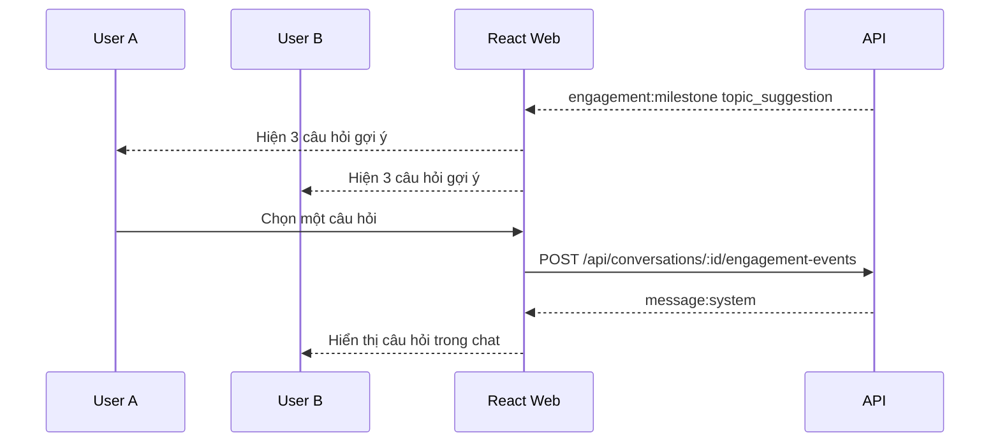
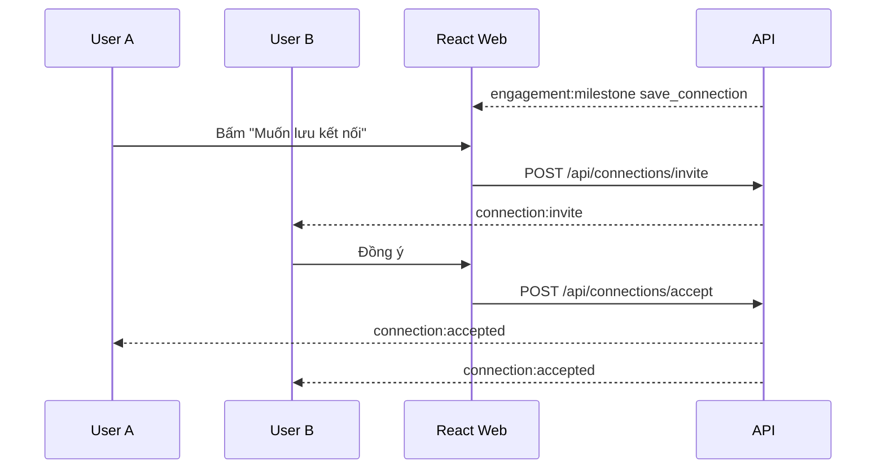

# Business Flows - Chat Ẩn Danh Việt Nam

## 1. Nguyên Tắc Sản Phẩm

Sản phẩm phục vụ chính cho người Việt Nam, nên trải nghiệm mặc định phải là tiếng Việt:

- Toàn bộ nút, menu, form, lỗi validate, thông báo, empty state, modal, admin label hiển thị bằng tiếng Việt.
- Locale mặc định là `vi-VN`.
- Nơi ở dùng danh sách tỉnh/thành Việt Nam hoặc khu vực, không yêu cầu địa chỉ chính xác.
- Chủ đề phòng chat dùng ngôn ngữ tự nhiên với người Việt: Tâm sự, Hẹn hò, Học tập, Công nghệ, Giải trí, Đêm khuya.
- Tone nội dung thân thiện, ngắn, dễ hiểu, không quá trang trọng.

## 2. Luồng Business Tổng Quan

```text
Vào web
  -> Bắt đầu ẩn danh
  -> Điền profile nhanh
  -> Chọn muốn nói chuyện với ai
  -> Tìm người lạ
  -> Chat text realtime
  -> Nếu hợp: milestone gợi ý tương tác
  -> Phase 2: nếu cả hai đồng ý, lưu kết nối ẩn danh
  -> Phase sau: mở audio/video call có cảnh báo riêng tư
  -> Sau chat: đánh giá nhẹ, report/block nếu cần, tìm người mới
```

## 3. Luồng Người Dùng Việt Nam

### 3.1 Người mới vào lần đầu

1. User mở trang.
2. Trang hiển thị tiếng Việt, CTA chính: "Bắt đầu ẩn danh".
3. User chọn tiếp tục với khách hoặc đăng nhập/đăng ký nhanh bằng email; Google có thể bật khi cấu hình OAuth.
4. User điền profile nhanh:
   - Tên hiển thị.
   - Tuổi.
   - Tỉnh/thành.
   - Giới tính.
   - Muốn nói chuyện với Nam, Nữ, Khác hoặc Tất cả.
5. User chọn giới tính muốn gặp rồi bấm "Tìm người lạ".
6. Hệ thống match người phù hợp và ưu tiên chưa từng gặp.

### 3.2 Người quay lại

1. User mở web.
2. Nếu còn session/account, hệ thống dùng lại profile đã lưu.
3. User có thể sửa profile trước khi tìm người.
4. User bấm "Tìm người lạ" hoặc vào phòng theo chủ đề.

## 4. Luồng Giữ Hứng Thú Khi Chat Lâu

Mục tiêu là giúp hai người có thêm lý do tiếp tục nói chuyện mà không ép họ lộ danh tính.

| Mốc | Điều kiện gợi ý | Trải nghiệm |
|---|---|---|
| Mốc 1 | 3 phút hoặc 10 tin nhắn | Hiện "Gợi ý câu chuyện" với 3 câu hỏi nhẹ |
| Mốc 2 | 8 phút hoặc 25 tin nhắn | Mở "Trò nhanh 2 người" như chọn nhanh A/B |
| Mốc 3 | 15 phút hoặc 50 tin nhắn | Gợi ý "Lưu kết nối ẩn danh" nếu cả hai đồng ý |
| Mốc 4 | 20 phút hoặc 70 tin nhắn | Phase sau: mời audio call ẩn danh nếu cả hai đồng ý |
| Mốc 5 | 30 phút hoặc 100 tin nhắn | Phase sau: mời video call với cảnh báo lộ mặt/giọng |

Business rule:

- Milestone không được che ô nhập tin nhắn.
- Gợi ý phải có nút bỏ qua.
- Không gửi lời mời call tự động; chỉ hiển thị tùy chọn.
- Nếu một người từ chối, người còn lại không biết lý do chi tiết.
- Nếu có report/block trong conversation, không mở milestone call.

## 5. Flow: Gợi Ý Chủ Đề



Ví dụ câu hỏi tiếng Việt:

- "Nếu tối nay được đi đâu đó ngay, bạn muốn đi đâu?"
- "Một điều nhỏ gần đây làm bạn vui là gì?"
- "Bạn thích nói chuyện nghiêm túc hay vui vui hơn?"

## 6. Flow: Trò Nhanh 2 Người

```text
Chat đủ 8 phút
  -> Hiện chip "Chơi nhanh"
  -> User A chọn
  -> User B nhận lời
  -> Hệ thống đưa 5 câu A/B
  -> Hai bên trả lời
  -> Hiển thị điểm giống nhau
  -> Quay lại chat
```

Ví dụ:

- Cà phê hay trà sữa?
- Đi biển hay đi Đà Lạt?
- Nhắn tin cả đêm hay gọi 10 phút?
- Hướng nội hay hướng ngoại?
- Nhạc buồn hay nhạc vui?

## 7. Flow: Lưu Kết Nối Ẩn Danh, Phase 2

Mục tiêu là cho hai người tiếp tục gặp lại mà chưa cần lộ số điện thoại, Facebook hoặc danh tính thật.



Business rule:

- Chỉ tạo kết nối khi cả hai cùng đồng ý.
- Tên hiển thị trong danh sách kết nối vẫn là nickname/alias.
- Một trong hai có thể hủy kết nối bất cứ lúc nào.
- Nếu một người bị ban hoặc block, kết nối bị vô hiệu hóa.

## 8. Flow: Audio/Video Call Sau Khi Chat Lâu

Audio/video call không nên nằm trong MVP đầu tiên. Đây là phase sau vì call có rủi ro lộ mặt, lộ giọng và cần WebRTC/TURN.

### 8.1 Điều kiện mở khóa

- Conversation đủ mốc thời gian/tin nhắn.
- Cả hai user không bị mute/ban.
- Conversation không có report nghiêm trọng.
- Cả hai cùng bấm đồng ý.
- Trước video call phải có màn hình cảnh báo: "Video call có thể làm lộ mặt và giọng nói của bạn."

### 8.2 Audio call

```text
Chat đủ 20 phút
  -> Hiện "Thử gọi thoại ẩn danh?"
  -> User A gửi lời mời
  -> User B đồng ý
  -> Hai bên vào màn hình preview mic
  -> Bắt đầu call
  -> Có nút tắt mic, kết thúc, report, block
```

### 8.3 Video call

```text
Chat đủ 30 phút
  -> Hiện "Mở video call?"
  -> Cảnh báo riêng tư
  -> User A gửi lời mời
  -> User B đồng ý
  -> Hai bên vào preview camera
  -> Camera mặc định tắt cho tới khi user bật
  -> Bắt đầu call
  -> Có nút tắt camera, tắt mic, kết thúc, report, block
```

Safety rule:

- Không ghi âm/ghi hình trong app.
- Không cho call nếu một trong hai chưa xác nhận đủ tuổi theo policy.
- Không tự động bật camera/mic.
- Không hiện email, account, số điện thoại trong màn hình call.
- Nút report/block luôn visible trong call.
- Call đầu tiên nên giới hạn thời lượng, ví dụ 5-10 phút, để giảm rủi ro và chi phí.

## 9. Monetization Gợi Ý

- Free: chat text, gợi ý chủ đề, trò nhanh cơ bản.
- Registered, Phase 2: lưu kết nối ẩn danh, lịch sử kết nối.
- Premium sau MVP:
  - Ưu tiên matching.
  - Thêm lượt audio/video call.
  - Bộ lọc tuổi/khu vực nâng cao.
  - Theme giao diện.

Không nên chèn quảng cáo giữa cuộc chat đang diễn ra. Nếu có ads, đặt ở lobby, matching screen hoặc sau khi kết thúc conversation.

## 10. Copy Tiếng Việt Mẫu

CTA:

- "Bắt đầu ẩn danh"
- "Tìm người lạ"
- "Đổi người"
- "Kết thúc"
- "Báo cáo"
- "Chặn"

Milestone:

- "Hai bạn nói chuyện khá hợp đó. Muốn thử một câu hỏi vui không?"
- "Muốn lưu kết nối ẩn danh để gặp lại sau không?"
- "Chỉ khi cả hai đồng ý thì kết nối mới được lưu."
- "Video call có thể làm lộ mặt và giọng nói của bạn. Hãy cân nhắc trước khi bật."
