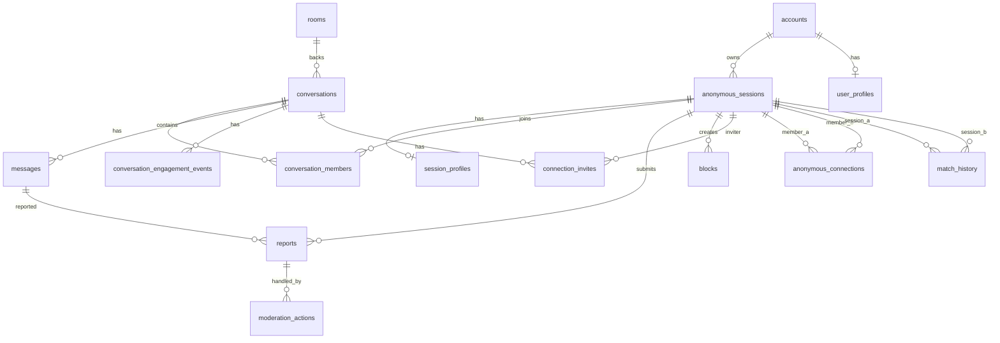

# Data Model & Privacy - Chat Ẩn Danh

## 1. Data Principles

- Thu thập ít dữ liệu nhất có thể.
- Người dùng không cần đăng ký vẫn dùng được.
- Người dùng phải có profile tối thiểu trước khi matching.
- Registered account không làm mất ẩn danh trong conversation.
- Public payload chỉ chứa profile công khai tối thiểu: tên hiển thị/nickname, tuổi hoặc nhóm tuổi, tỉnh/thành, giới tính, avatar tạm.
- IP/device chỉ lưu dạng hash có salt và TTL để chống lạm dụng.
- Tin nhắn anonymous có retention mặc định.
- Admin/moderator chỉ xem nội dung khi có report hoặc quyền phù hợp.

## 2. Entity Overview



## 3. Tables

### accounts

Registered user account. Không gửi object này cho người đối diện.

| Column | Type | Notes |
|---|---|---|
| id | uuid | Primary key |
| email | varchar unique | Nullable nếu OAuth-only sau này |
| password_hash | text | Không bao giờ trả về client |
| display_name | varchar | Mã công khai tạm do server sinh khi đăng ký; có thể cập nhật theo profile riêng sau khi user hoàn tất hồ sơ |
| google_sub | varchar unique nullable | ID Google/OIDC, không show public |
| auth_provider | enum | email, google |
| role | enum | user, moderator, admin |
| status | enum | active, suspended, deleted |
| created_at | timestamptz |  |
| updated_at | timestamptz |  |
| deleted_at | timestamptz nullable | Soft delete |

### anonymous_sessions

Mỗi lượt dùng ẩn danh. Guest và registered đều có session khi chat.

| Column | Type | Notes |
|---|---|---|
| id | uuid | Primary key |
| account_id | uuid nullable | Null với guest |
| base_alias | varchar | Alias user chọn hoặc random |
| avatar_key | varchar | Avatar random |
| profile_complete | boolean | Phải true trước matching |
| status | enum | active, muted, banned, expired |
| ip_hash | text nullable | TTL hoặc rotate salt |
| device_hash | text nullable | Không expose |
| user_agent_hash | text nullable | Không expose |
| last_seen_at | timestamptz | Presence |
| expires_at | timestamptz | Guest expiry |
| created_at | timestamptz |  |

### user_profiles

Profile lâu dài cho registered account. Không chứa email public.

| Column | Type | Notes |
|---|---|---|
| id | uuid | Primary key |
| account_id | uuid unique | FK accounts |
| display_name | varchar | Tên hiển thị/nickname, không bắt buộc tên thật |
| age | int | MVP validate 18-99 nếu app 18+ |
| location | varchar | Tỉnh/thành hoặc khu vực, không lưu địa chỉ chính xác |
| gender | enum | male, female, other |
| desired_genders | enum[] hoặc jsonb | male, female, other; chọn cả 3 là tất cả |
| created_at | timestamptz |  |
| updated_at | timestamptz |  |

### session_profiles

Profile tạm cho guest session hoặc snapshot profile khi user chat ẩn danh.

| Column | Type | Notes |
|---|---|---|
| id | uuid | Primary key |
| session_id | uuid unique | FK anonymous_sessions |
| display_name | varchar | Tên hiển thị/nickname |
| age | int |  |
| location | varchar | Tỉnh/thành hoặc khu vực |
| gender | enum | male, female, other |
| desired_genders | enum[] hoặc jsonb | Preference matching |
| created_at | timestamptz |  |
| updated_at | timestamptz |  |

### topics

| Column | Type | Notes |
|---|---|---|
| id | uuid | Primary key |
| slug | varchar unique | tam-su, giai-tri |
| name | varchar | Display name |
| description | text |  |
| enabled | boolean |  |

Seed topics:

```text
tam-su
giai-tri
hoc-tap
hen-ho
cong-nghe
```

### rooms

| Column | Type | Notes |
|---|---|---|
| id | uuid | Primary key |
| topic_id | uuid | FK topics |
| slug | varchar unique |  |
| name | varchar |  |
| description | text |  |
| enabled | boolean |  |
| created_at | timestamptz |  |

### conversations

| Column | Type | Notes |
|---|---|---|
| id | uuid | Primary key |
| type | enum | direct, room |
| topic_id | uuid nullable |  |
| room_id | uuid nullable | Only room conversation |
| status | enum | active, ended, locked |
| started_at | timestamptz |  |
| ended_at | timestamptz nullable |  |
| retention_delete_at | timestamptz | Cleanup target |

### conversation_members

| Column | Type | Notes |
|---|---|---|
| id | uuid | Primary key |
| conversation_id | uuid | FK |
| session_id | uuid | FK anonymous_sessions |
| public_alias | varchar | Alias riêng trong conversation |
| public_avatar_key | varchar | Avatar riêng trong conversation |
| public_age | int nullable | Snapshot tuổi public tại thời điểm join |
| public_location | varchar nullable | Snapshot tỉnh/thành public |
| public_gender | enum nullable | Snapshot giới tính public |
| role | enum | member, moderator |
| joined_at | timestamptz |  |
| left_at | timestamptz nullable |  |

Important:

- `public_alias` có thể khác `base_alias`.
- Client chỉ thấy `conversation_members.id`, `public_alias`, `public_avatar_key`, `public_age`, `public_location`, `public_gender`.
- Client không thấy `desired_genders` của đối phương trừ khi sản phẩm cố tình hiển thị.

### messages

| Column | Type | Notes |
|---|---|---|
| id | uuid | Primary key |
| conversation_id | uuid | FK |
| sender_member_id | uuid | FK conversation_members |
| client_message_id | varchar nullable | De-duplicate |
| body | text | Text message, có thể rỗng nếu message chỉ có ảnh |
| attachment | jsonb nullable | Attachment public của message, hiện chỉ hỗ trợ ảnh với `type`, `url`, `mimeType`, `name`, `size`, `alt` |
| status | enum | sent, delivered, failed, hidden_by_moderation |
| moderation_status | enum | clean, flagged, hidden |
| created_at | timestamptz |  |
| deleted_at | timestamptz nullable | Retention/moderation delete |

Indexes:

- `(conversation_id, created_at desc)`.
- `(sender_member_id, created_at desc)`.
- Unique `(sender_member_id, client_message_id)` when client id exists.

### blocks

| Column | Type | Notes |
|---|---|---|
| id | uuid | Primary key |
| blocker_session_id | uuid |  |
| blocked_session_id | uuid |  |
| conversation_id | uuid nullable | Context |
| reason | varchar nullable |  |
| created_at | timestamptz |  |

Rule:

- Matching must exclude pairs where either side blocked the other.

### match_history

Lịch sử ghép cặp để tránh cho user gặp lại người cũ khi vẫn còn nhiều người mới phù hợp.

| Column | Type | Notes |
|---|---|---|
| id | uuid | Primary key |
| identity_a_key | text | HMAC stable key, sorted, không expose |
| identity_b_key | text | HMAC stable key, sorted, không expose |
| session_a_id | uuid nullable | Last session A |
| session_b_id | uuid nullable | Last session B |
| last_conversation_id | uuid nullable | Conversation gần nhất của cặp |
| conversation_count | int | Số lần đã ghép |
| first_matched_at | timestamptz |  |
| last_matched_at | timestamptz | Dùng để chọn người gặp lại lâu nhất nếu phải fallback |
| expires_at | timestamptz | Cleanup theo retention |

Rules:

- `identity_a_key` và `identity_b_key` phải được sort để cùng một cặp chỉ có một row.
- Với registered account, identity key nên là HMAC của `account:{accountId}`.
- Với guest, identity key nên là HMAC của `session:{sessionId}`.
- Không dùng email, Google id, IP hoặc device hash trực tiếp làm identity key.
- Matching phải xem `match_history` trước khi chọn candidate.
- Nếu còn fresh candidate phù hợp, không chọn repeat candidate trong cooldown.

### conversation_engagement_events

Lưu các mốc giữ hứng thú trong conversation như gợi ý chủ đề trong MVP; trò nhanh và lưu kết nối là Phase 2 by default.

| Column | Type | Notes |
|---|---|---|
| id | uuid | Primary key |
| conversation_id | uuid | FK conversations |
| actor_session_id | uuid nullable | Null nếu event do hệ thống tạo |
| type | enum | topic_suggestion, quick_game, save_connection_prompt, call_unlock_prompt |
| payload_json | jsonb nullable | Câu hỏi/gợi ý bằng tiếng Việt |
| created_at | timestamptz |  |

Rules:

- Payload user-facing phải là tiếng Việt.
- Không lưu dữ liệu nhạy cảm trong payload.
- Event này dùng cho analytics và tránh spam milestone.

### connection_invites

Phase 2 by default. MVP may omit this table from the first migration unless saved connections are explicitly requested.

Lời mời lưu kết nối ẩn danh giữa hai người sau khi chat đủ lâu.

| Column | Type | Notes |
|---|---|---|
| id | uuid | Primary key |
| conversation_id | uuid | FK conversations |
| inviter_session_id | uuid | Người gửi lời mời |
| invitee_session_id | uuid | Người nhận lời mời |
| status | enum | pending, accepted, declined, expired, revoked |
| created_at | timestamptz |  |
| responded_at | timestamptz nullable |  |
| expires_at | timestamptz nullable |  |

Rules:

- Không tạo kết nối nếu chỉ một bên đồng ý.
- Nếu bị block/report nghiêm trọng, invite phải bị vô hiệu hóa.

### anonymous_connections

Phase 2 by default. MVP may omit this table from the first migration unless saved connections are explicitly requested.

Kết nối ẩn danh đã được cả hai đồng ý. Cho phép hai người gặp lại mà chưa cần lộ danh tính thật.

| Column | Type | Notes |
|---|---|---|
| id | uuid | Primary key |
| member_a_session_id | uuid | Sorted or stable side A |
| member_b_session_id | uuid | Sorted or stable side B |
| invite_id | uuid nullable | Invite tạo ra connection |
| status | enum | active, revoked, blocked |
| created_at | timestamptz |  |
| revoked_at | timestamptz nullable |  |

Rules:

- Tên trong danh sách kết nối vẫn là alias/nickname.
- Một trong hai có thể hủy kết nối.
- Nếu block, connection status chuyển thành `blocked`.

### reports

| Column | Type | Notes |
|---|---|---|
| id | uuid | Primary key |
| reporter_session_id | uuid |  |
| target_session_id | uuid nullable | Derived from target participant |
| conversation_id | uuid |  |
| message_id | uuid nullable |  |
| reason | enum | spam, harassment, scam, sexual_content, minor_safety, violence, privacy, other |
| note | text nullable |  |
| snapshot_json | jsonb nullable | Limited context |
| status | enum | open, reviewing, resolved, dismissed |
| severity | enum | low, medium, high, critical |
| created_at | timestamptz |  |
| resolved_at | timestamptz nullable |  |

### moderation_actions

| Column | Type | Notes |
|---|---|---|
| id | uuid | Primary key |
| report_id | uuid nullable |  |
| moderator_account_id | uuid |  |
| target_session_id | uuid nullable |  |
| action | enum | ignore, warn, mute, ban, hide_message, close_report |
| duration_minutes | int nullable | For mute/ban |
| note | text nullable |  |
| created_at | timestamptz | Audit log |

### refresh_tokens

| Column | Type | Notes |
|---|---|---|
| id | uuid | Primary key |
| account_id | uuid |  |
| token_hash | text | Never store raw token |
| expires_at | timestamptz |  |
| revoked_at | timestamptz nullable |  |
| created_at | timestamptz |  |

## 4. Privacy Rules

### Public data allowed in chat

```json
{
  "participantId": "conversation_member_id",
  "alias": "AD-4827",
  "avatarKey": "avatar_blue_03",
  "age": 22,
  "location": "TP. Hồ Chí Minh",
  "gender": "female",
  "online": true
}
```

### Data forbidden in public chat payload

```text
account_id
session_id
email
google_sub
phone
ip
ip_hash
device_hash
user_agent_hash
password_hash
refresh_token_hash
internal moderation scores
exact address
desired_genders
```

## 5. Retention Policy

| Data | MVP Retention |
|---|---|
| Guest anonymous session | 24 giờ không hoạt động, metadata safety giữ tối đa 30 ngày |
| Direct anonymous messages | 30 ngày |
| Room messages | 30 ngày |
| Guest session profile | Theo guest session, metadata safety tối đa 30 ngày |
| Registered user profile | Giữ tới khi user xóa tài khoản hoặc chỉnh profile |
| Match history | 30 ngày hoặc theo `MATCH_HISTORY_RETENTION_DAYS` |
| Engagement events | 30 ngày |
| Connection invites | 30 ngày hoặc hết hạn invite |
| Anonymous connections | Giữ tới khi user hủy, block hoặc xóa tài khoản |
| Report records | 180 ngày |
| Moderation audit logs | 1 năm |
| IP/device hash | 30 ngày hoặc ít hơn |
| Deleted account personal data | Xóa/anonymize trong 30 ngày |

Config keys:

```text
GUEST_SESSION_TTL_HOURS=24
MESSAGE_RETENTION_DAYS=30
REPORT_RETENTION_DAYS=180
SAFETY_HASH_RETENTION_DAYS=30
MATCH_HISTORY_RETENTION_DAYS=30
ENGAGEMENT_EVENT_RETENTION_DAYS=30
CONNECTION_INVITE_RETENTION_DAYS=30
```

## 6. Safety Hashing

Hash IP/device để chống abuse nhưng giảm rủi ro riêng tư.

Rules:

- Dùng HMAC với secret server-side, không dùng hash thường.
- Rotate secret theo kỳ nếu có thể.
- Không hiển thị hash trong admin UI trừ super admin.
- Không dùng IP/device hash để định danh public.

Pseudo:

```ts
function safetyHash(value: string, secret: string): string {
  return hmacSha256(secret, normalize(value));
}
```

## 7. Prisma Model Draft

Đây là draft để AI/dev triển khai, có thể chỉnh tên theo code style.

```prisma
enum AccountRole {
  user
  moderator
  admin
}

enum AuthProvider {
  email
  google
}

enum Gender {
  male
  female
  other
}

enum SessionStatus {
  active
  muted
  banned
  expired
}

enum ConversationType {
  direct
  room
}

enum ConversationStatus {
  active
  ended
  locked
}

enum MessageStatus {
  sent
  delivered
  failed
  hidden_by_moderation
}

enum ReportReason {
  spam
  harassment
  scam
  sexual_content
  minor_safety
  violence
  privacy
  other
}

enum ReportStatus {
  open
  reviewing
  resolved
  dismissed
}

enum ReportSeverity {
  low
  medium
  high
  critical
}

enum ModerationActionType {
  ignore
  warn
  mute
  ban
  hide_message
  close_report
}

enum EngagementEventType {
  topic_suggestion
  quick_game
  save_connection_prompt
  call_unlock_prompt
}

enum ConnectionInviteStatus {
  pending
  accepted
  declined
  expired
  revoked
}

enum AnonymousConnectionStatus {
  active
  revoked
  blocked
}

model Account {
  id           String   @id @default(uuid())
  email        String?  @unique
  googleSub    String?  @unique
  authProvider AuthProvider @default(email)
  passwordHash String?
  displayName  String?
  role         AccountRole @default(user)
  status       String   @default("active")
  createdAt    DateTime @default(now())
  updatedAt    DateTime @updatedAt
  deletedAt    DateTime?

  sessions AnonymousSession[]
  profile UserProfile?
  moderationActions ModerationAction[]
  refreshTokens RefreshToken[]
}

model AnonymousSession {
  id            String   @id @default(uuid())
  accountId     String?
  baseAlias     String
  avatarKey     String
  profileComplete Boolean @default(false)
  status        SessionStatus @default(active)
  ipHash        String?
  deviceHash    String?
  userAgentHash String?
  lastSeenAt    DateTime @default(now())
  expiresAt     DateTime?
  createdAt     DateTime @default(now())

  account Account? @relation(fields: [accountId], references: [id])
  profile SessionProfile?
  members ConversationMember[]
  submittedReports Report[] @relation("ReportReporter")
  targetedReports  Report[] @relation("ReportTarget")
  blocksCreated    Block[]  @relation("Blocker")
  blocksReceived   Block[]  @relation("Blocked")
  engagementEvents ConversationEngagementEvent[] @relation("EngagementActor")
  connectionInvitesSent ConnectionInvite[] @relation("ConnectionInviter")
  connectionInvitesReceived ConnectionInvite[] @relation("ConnectionInvitee")
  connectionsAsA AnonymousConnection[] @relation("ConnectionMemberA")
  connectionsAsB AnonymousConnection[] @relation("ConnectionMemberB")
  matchesAsA        MatchHistory[] @relation("MatchHistoryA")
  matchesAsB        MatchHistory[] @relation("MatchHistoryB")
  moderationActions ModerationAction[] @relation("ModerationTarget")
}

model UserProfile {
  id             String @id @default(uuid())
  accountId      String @unique
  displayName    String
  age            Int
  location       String
  gender         Gender
  desiredGenders Json
  createdAt      DateTime @default(now())
  updatedAt      DateTime @updatedAt

  account Account @relation(fields: [accountId], references: [id])

  @@index([gender])
  @@index([location])
}

model SessionProfile {
  id             String @id @default(uuid())
  sessionId      String @unique
  displayName    String
  age            Int
  location       String
  gender         Gender
  desiredGenders Json
  createdAt      DateTime @default(now())
  updatedAt      DateTime @updatedAt

  session AnonymousSession @relation(fields: [sessionId], references: [id])

  @@index([gender])
  @@index([location])
}

model Topic {
  id          String @id @default(uuid())
  slug        String @unique
  name        String
  description String?
  enabled     Boolean @default(true)

  rooms Room[]
  conversations Conversation[]
}

model Room {
  id          String @id @default(uuid())
  topicId     String
  slug        String @unique
  name        String
  description String?
  enabled     Boolean @default(true)
  createdAt   DateTime @default(now())

  topic Topic @relation(fields: [topicId], references: [id])
  conversations Conversation[]
}

model Conversation {
  id                String @id @default(uuid())
  type              ConversationType
  topicId           String?
  roomId            String?
  status            ConversationStatus @default(active)
  startedAt         DateTime @default(now())
  endedAt           DateTime?
  retentionDeleteAt DateTime?

  topic Topic? @relation(fields: [topicId], references: [id])
  room  Room?  @relation(fields: [roomId], references: [id])
  members ConversationMember[]
  messages Message[]
  reports Report[]
  blocks Block[]
  engagementEvents ConversationEngagementEvent[]
  connectionInvites ConnectionInvite[]
  matchHistoriesAsLast MatchHistory[]
}

model ConversationMember {
  id              String @id @default(uuid())
  conversationId  String
  sessionId       String
  publicAlias     String
  publicAvatarKey String
  publicAge       Int?
  publicLocation  String?
  publicGender    Gender?
  role            String @default("member")
  joinedAt        DateTime @default(now())
  leftAt          DateTime?

  conversation Conversation @relation(fields: [conversationId], references: [id])
  session      AnonymousSession @relation(fields: [sessionId], references: [id])
  messages     Message[]
}

model Message {
  id               String @id @default(uuid())
  conversationId   String
  senderMemberId   String
  clientMessageId  String?
  body             String
  attachment       Json?
  status           MessageStatus @default(sent)
  moderationStatus String @default("clean")
  createdAt        DateTime @default(now())
  deletedAt        DateTime?

  conversation Conversation @relation(fields: [conversationId], references: [id])
  sender       ConversationMember @relation(fields: [senderMemberId], references: [id])
  reports      Report[]

  @@index([conversationId, createdAt])
  @@index([senderMemberId, createdAt])
  @@unique([senderMemberId, clientMessageId])
}

model Block {
  id               String @id @default(uuid())
  blockerSessionId String
  blockedSessionId String
  conversationId   String?
  reason           String?
  createdAt        DateTime @default(now())

  blockerSession AnonymousSession @relation("Blocker", fields: [blockerSessionId], references: [id])
  blockedSession AnonymousSession @relation("Blocked", fields: [blockedSessionId], references: [id])
  conversation   Conversation? @relation(fields: [conversationId], references: [id])

  @@index([blockerSessionId])
  @@index([blockedSessionId])
  @@unique([blockerSessionId, blockedSessionId])
}

model MatchHistory {
  id                 String @id @default(uuid())
  identityAKey       String
  identityBKey       String
  sessionAId         String?
  sessionBId         String?
  lastConversationId String?
  conversationCount  Int @default(1)
  firstMatchedAt     DateTime @default(now())
  lastMatchedAt      DateTime @default(now())
  expiresAt          DateTime?

  sessionA         AnonymousSession? @relation("MatchHistoryA", fields: [sessionAId], references: [id])
  sessionB         AnonymousSession? @relation("MatchHistoryB", fields: [sessionBId], references: [id])
  lastConversation Conversation? @relation(fields: [lastConversationId], references: [id])

  @@unique([identityAKey, identityBKey])
  @@index([identityAKey])
  @@index([identityBKey])
  @@index([lastMatchedAt])
  @@index([expiresAt])
}

model ConversationEngagementEvent {
  id             String @id @default(uuid())
  conversationId String
  actorSessionId String?
  type           EngagementEventType
  payloadJson    Json?
  createdAt      DateTime @default(now())

  conversation Conversation @relation(fields: [conversationId], references: [id])
  actorSession AnonymousSession? @relation("EngagementActor", fields: [actorSessionId], references: [id])

  @@index([conversationId, createdAt])
  @@index([type, createdAt])
}

model ConnectionInvite {
  id               String @id @default(uuid())
  conversationId   String
  inviterSessionId String
  inviteeSessionId String
  status           ConnectionInviteStatus @default(pending)
  createdAt        DateTime @default(now())
  respondedAt      DateTime?
  expiresAt        DateTime?

  conversation   Conversation @relation(fields: [conversationId], references: [id])
  inviterSession AnonymousSession @relation("ConnectionInviter", fields: [inviterSessionId], references: [id])
  inviteeSession AnonymousSession @relation("ConnectionInvitee", fields: [inviteeSessionId], references: [id])
  connection     AnonymousConnection?

  @@index([conversationId])
  @@index([inviteeSessionId, status])
  @@index([expiresAt])
}

model AnonymousConnection {
  id               String @id @default(uuid())
  memberASessionId String
  memberBSessionId String
  inviteId         String? @unique
  status           AnonymousConnectionStatus @default(active)
  createdAt        DateTime @default(now())
  revokedAt        DateTime?

  memberASession AnonymousSession @relation("ConnectionMemberA", fields: [memberASessionId], references: [id])
  memberBSession AnonymousSession @relation("ConnectionMemberB", fields: [memberBSessionId], references: [id])
  invite         ConnectionInvite? @relation(fields: [inviteId], references: [id])

  @@unique([memberASessionId, memberBSessionId])
  @@index([memberASessionId])
  @@index([memberBSessionId])
  @@index([status])
}

model Report {
  id                String @id @default(uuid())
  reporterSessionId String
  targetSessionId   String?
  conversationId    String
  messageId         String?
  reason            ReportReason
  note              String?
  snapshotJson      Json?
  status            ReportStatus @default(open)
  severity          ReportSeverity @default(low)
  createdAt         DateTime @default(now())
  resolvedAt        DateTime?

  reporterSession AnonymousSession @relation("ReportReporter", fields: [reporterSessionId], references: [id])
  targetSession   AnonymousSession? @relation("ReportTarget", fields: [targetSessionId], references: [id])
  conversation    Conversation @relation(fields: [conversationId], references: [id])
  message         Message? @relation(fields: [messageId], references: [id])
  actions         ModerationAction[]

  @@index([status, createdAt])
  @@index([reason, createdAt])
  @@index([targetSessionId])
}

model ModerationAction {
  id                 String @id @default(uuid())
  reportId           String?
  moderatorAccountId String
  targetSessionId    String?
  action             ModerationActionType
  durationMinutes    Int?
  note               String?
  createdAt          DateTime @default(now())

  report           Report? @relation(fields: [reportId], references: [id])
  moderatorAccount Account @relation(fields: [moderatorAccountId], references: [id])
  targetSession    AnonymousSession? @relation("ModerationTarget", fields: [targetSessionId], references: [id])

  @@index([reportId])
  @@index([targetSessionId])
  @@index([createdAt])
}

model RefreshToken {
  id        String @id @default(uuid())
  accountId String
  tokenHash String
  expiresAt DateTime
  revokedAt DateTime?
  createdAt DateTime @default(now())

  account Account @relation(fields: [accountId], references: [id])

  @@index([accountId])
  @@index([expiresAt])
}
```

## 8. Cleanup Jobs

BullMQ jobs:

| Job | Schedule | Action |
|---|---|---|
| `sessions.expire` | every 10 minutes | Expire inactive guest sessions |
| `messages.retention` | daily | Soft delete messages past retention |
| `matchHistory.retention` | daily | Delete expired match history rows |
| `engagement.retention` | daily | Delete expired engagement events |
| `connectionInvites.expire` | every 10 minutes | Expire old pending connection invites |
| `reports.retention` | daily | Archive/delete old reports |
| `presence.sweep` | every 1 minute | Clear stale online status |
| `moderation.autoFlag` | near realtime | Flag spam/report thresholds |

## 9. Admin Visibility Rules

| Role | Can See |
|---|---|
| Moderator | Reports, limited message context, public aliases, action history |
| Admin | Moderator view plus room config and metrics |
| Super Admin, optional | Safety hashes and advanced abuse investigation |

Moderator UI should not show raw email/IP/device. If account email is needed for account support, separate support permission from moderation permission.
