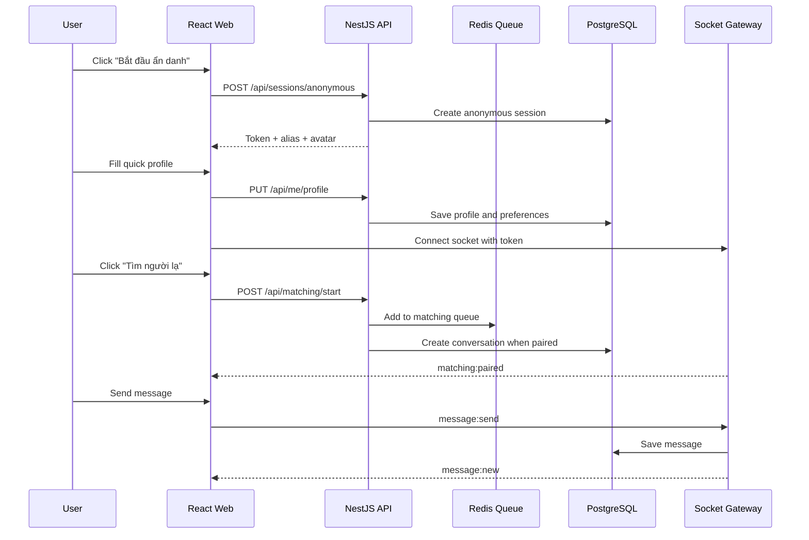
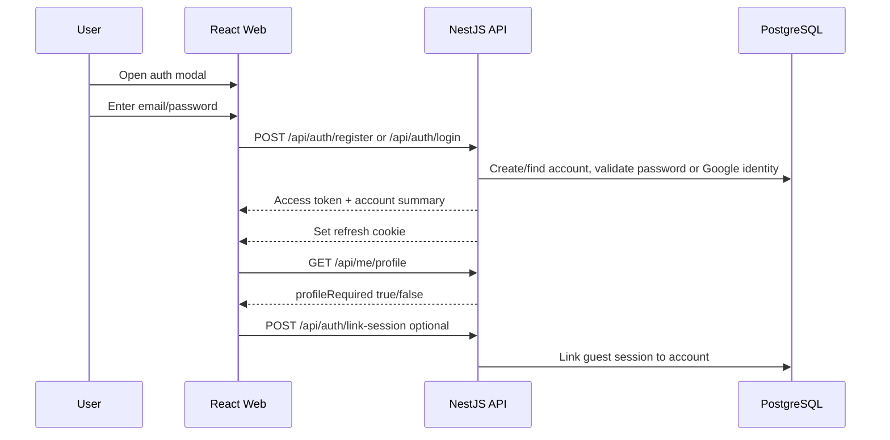
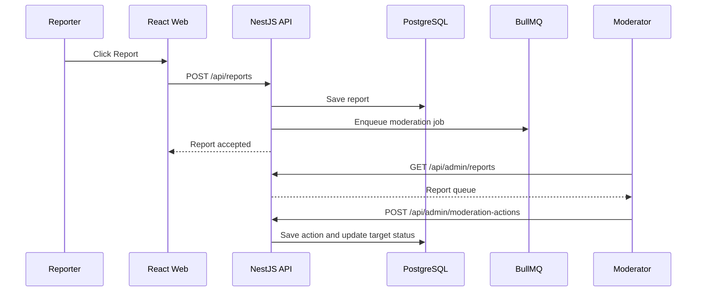
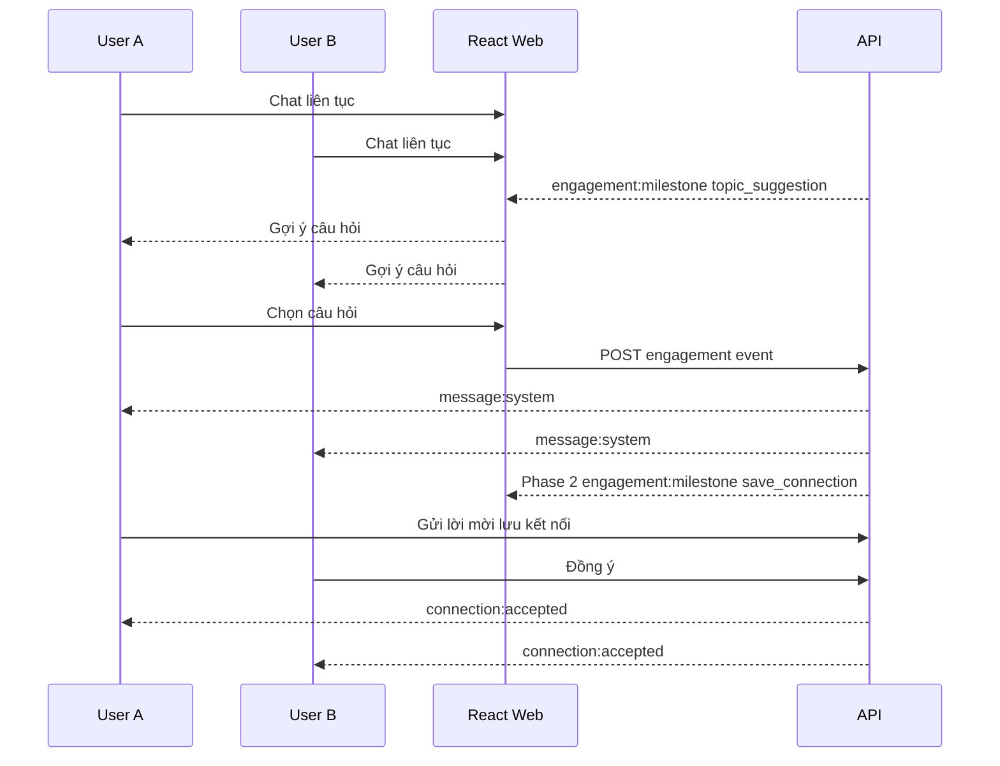

# Product Requirements - Chat Ẩn Danh

## 1. Mục Tiêu

Xây dựng một web app chat ẩn danh hiện đại, mobile-first cho người Việt Nam, với giao diện mặc định bằng tiếng Việt. Người dùng có thể vào trò chuyện cực nhanh nhưng vẫn có đăng ký/đăng nhập bằng email/password hoặc Google account nếu muốn giữ cài đặt cá nhân. Trước khi chat, người dùng phải hoàn tất profile tối thiểu gồm tên hiển thị, tuổi, tỉnh/thành, giới tính và giới tính muốn trò chuyện. Sản phẩm phải tạo cảm giác tự do chia sẻ, dễ bắt chuyện, ít ma sát, nhưng có guardrails để chống spam, quấy rối, lừa đảo và nội dung bất hợp pháp.

## 2. Product Promise

Người dùng có thể mở web, bấm "Bắt đầu ẩn danh", điền profile nhanh trong 1 màn hình và được ghép với một người lạ phù hợp để chat ngay. Người đối diện chỉ thấy profile công khai tối thiểu, không biết tài khoản thật, email/Gmail, IP hay thông tin thiết bị của họ.

Không promise:

- Không promise rằng hệ thống không có log kỹ thuật nào.
- Không promise rằng người dùng có thể làm việc bất hợp pháp hoặc gây hại.
- Không promise mã hóa đầu cuối trong MVP.

## 3. User Roles

| Role | Mô tả |
|---|---|
| Guest | Người dùng ẩn danh, không đăng ký, có session tạm |
| Registered User | Người dùng có tài khoản, vẫn chat bằng alias ẩn danh |
| Premium User | Người dùng trả phí, có thêm filter/theme/ưu tiên matching |
| Moderator | Xử lý report, mute, warning, ban |
| Admin | Quản lý hệ thống, cấu hình phòng, user, report, metrics |

## 4. Business Goals

| ID | Requirement | Priority |
|---|---|---|
| BR-001 | Người dùng mới vào được chat trong dưới 15 giây | Must |
| BR-002 | Tài khoản đăng ký/đăng nhập không bắt buộc trước khi chat; profile tối thiểu vẫn bắt buộc | Must |
| BR-003 | Giữ danh tính thật riêng tư giữa các người dùng | Must |
| BR-004 | Có report, block, rate limit ngay từ MVP | Must |
| BR-005 | Có phòng/chủ đề để tăng retention | Should |
| BR-006 | Có nền tảng premium/ads sau MVP | Should |
| BR-007 | Có dashboard admin/moderator | Must |
| BR-008 | Profile tối thiểu bắt buộc trước khi matching | Must |
| BR-009 | Matching ưu tiên theo giới tính muốn trò chuyện | Must |
| BR-010 | Khi còn nhiều user phù hợp, không ghép lại người đã từng gặp gần đây | Must |
| BR-011 | Toàn bộ user-facing UI hiển thị tiếng Việt mặc định | Must |
| BR-012 | Có cơ chế giữ hứng thú khi hai người chat lâu | Should |
| BR-013 | Audio/video call chỉ mở ở phase sau với đồng ý hai chiều | Could |

## 5. KPI Gợi Ý

- Activation: phần trăm user bấm "Bắt đầu ẩn danh" sau khi vào web.
- Match success rate: phần trăm request matching tìm được đối phương.
- Time to first match: thời gian từ bấm tìm đến khi ghép cặp.
- Repeat match rate: phần trăm conversation bị ghép lại với người đã gặp trong cooldown.
- First message rate: phần trăm conversation có ít nhất 1 tin nhắn.
- Conversation length: số tin nhắn trung bình mỗi conversation.
- Long-chat milestone rate: phần trăm conversation đạt mốc 10/25/50 tin nhắn.
- Save connection opt-in rate, Phase 2: phần trăm hai người đồng ý lưu kết nối ẩn danh.
- Call invitation opt-in rate, phase sau: phần trăm lời mời audio/video call được chấp nhận.
- Report rate: số report trên 1.000 tin nhắn.
- Block rate: số block trên 1.000 conversation.
- Retention D1/D7 cho registered user.

## 6. Scope MVP

### Must Have

| ID | Requirement |
|---|---|
| MVP-001 | Trang chính mở thẳng vào trải nghiệm chat/lobby |
| MVP-002 | Guest session không cần đăng ký |
| MVP-003 | Đăng ký bằng email/password |
| MVP-004 | Đăng nhập bằng email/password |
| MVP-005 | Đăng ký/đăng nhập bằng Google account |
| MVP-006 | Random 1-1 matching |
| MVP-007 | Room chat theo chủ đề |
| MVP-008 | Gửi/nhận text message realtime |
| MVP-009 | Typing indicator |
| MVP-010 | Online/presence |
| MVP-011 | Kết thúc chat và đổi người |
| MVP-012 | Block user/session |
| MVP-013 | Report message/conversation |
| MVP-014 | Rate limit chống spam |
| MVP-015 | Admin/moderator dashboard tối giản |
| MVP-016 | Chính sách retention tự xoá tin nhắn anonymous |
| MVP-017 | Profile bắt buộc gồm tên hiển thị, tuổi, tỉnh/thành, giới tính |
| MVP-018 | User chọn muốn nói chuyện với nam, nữ, giới tính khác hoặc tất cả |
| MVP-019 | Matching tránh ghép lại người đã gặp khi còn ứng viên mới |
| MVP-020 | Toàn bộ giao diện người dùng mặc định bằng tiếng Việt |
| MVP-021 | Gợi ý chủ đề khi hai người chat đủ lâu |

### Should Have

| ID | Requirement |
|---|---|
| SH-001 | Random match không hiển thị lựa chọn topic; phòng chủ đề là luồng riêng |
| SH-002 | Chọn khoảng tuổi muốn trò chuyện ở mức optional và không xác thực cứng |
| SH-003 | PWA installable |
| SH-004 | Dark mode |
| SH-005 | Email verification cho registered user |
| SH-006 | Forgot password |
| SH-007 | Trò nhanh 2 người khi conversation đủ mốc tương tác |
| SH-008 | Lưu kết nối ẩn danh khi cả hai cùng đồng ý |
| SH-009 | Audio call ẩn danh ở phase sau |
| SH-010 | Video call ở phase sau với cảnh báo riêng tư rõ ràng |

### Out Of Scope MVP

| ID | Requirement |
|---|---|
| OOS-001 | Video call |
| OOS-002 | Voice call |
| OOS-003 | Gửi ảnh/file |
| OOS-004 | Mã hóa đầu cuối |
| OOS-005 | AI matching phức tạp |
| OOS-006 | Native mobile app |

## 7. Functional Requirements

### 7.1 Anonymous Session

| ID | Requirement | Acceptance Criteria |
|---|---|---|
| ANON-001 | Hệ thống tạo guest session khi user bấm "Bắt đầu ẩn danh" | API trả `sessionId`, `accessToken`, `displayAlias`, `avatarKey` |
| ANON-002 | Mỗi conversation có alias riêng | Cùng một user gặp hai người khác nhau sẽ có alias khác nhau nếu bật random alias |
| ANON-003 | Người đối diện không thấy account id thật | API/socket payload không chứa `userId`, `email`, `phone`, `ip`, `deviceHash` |
| ANON-004 | Guest session có hạn dùng | Session hết hạn sau 24 giờ không hoạt động hoặc theo config |
| ANON-005 | Registered user vẫn chat ẩn danh | Đối phương chỉ thấy profile công khai trong chat, không thấy account profile/email/provider thật |
| ANON-006 | Profile công khai vẫn không phải danh tính thật | Dùng tên hiển thị/nickname, không yêu cầu họ tên pháp lý hoặc địa chỉ chính xác |

### 7.2 Authentication

| ID | Requirement | Acceptance Criteria |
|---|---|---|
| AUTH-001 | User có thể đăng ký bằng email/password | Validate email, password >= 8 ký tự, hash password bằng Argon2 hoặc bcrypt |
| AUTH-002 | User có thể đăng nhập | Trả access token và set refresh token bằng httpOnly cookie |
| AUTH-003 | User có thể logout | Thu hồi refresh token, disconnect socket nếu cần |
| AUTH-004 | User có thể tiếp tục từ guest sang account | Có endpoint link guest session vào account |
| AUTH-005 | User có thể xóa tài khoản | Xóa hoặc anonymize dữ liệu theo policy |
| AUTH-006 | User có thể đăng ký/đăng nhập bằng Google | Dùng OAuth/OIDC, không yêu cầu user nhập mật khẩu Gmail vào app |
| AUTH-007 | Auth xong nhưng thiếu profile thì chưa được matching | API matching trả `PROFILE_REQUIRED` |

### 7.3 Profile & Preferences

| ID | Requirement | Acceptance Criteria |
|---|---|---|
| PROF-001 | User phải điền tên hiển thị trước khi chat | `displayName` hoặc `nickname` dài 2-30 ký tự, không yêu cầu tên thật |
| PROF-002 | User phải điền tuổi | MVP yêu cầu age >= 18 nếu sản phẩm cho phép chủ đề người lớn; age lưu để matching/safety |
| PROF-003 | User phải chọn nơi ở | Chỉ lưu tỉnh/thành hoặc khu vực, không lấy số nhà/địa chỉ chính xác |
| PROF-004 | User phải chọn giới tính của mình | Giá trị: `male`, `female`, `other` |
| PROF-005 | User phải chọn giới tính muốn nói chuyện | Cho phép một hoặc nhiều giá trị: `male`, `female`, `other`; chọn cả 3 nghĩa là tất cả |
| PROF-006 | User có thể sửa profile | Sửa profile áp dụng cho lần matching tiếp theo, không đổi conversation đang active |
| PROF-007 | Profile công khai không chứa email/Gmail | Đối phương không thấy email hoặc provider đăng nhập |

### 7.4 Matching 1-1

| ID | Requirement | Acceptance Criteria |
|---|---|---|
| MATCH-001 | User bấm "Tìm người lạ" để vào queue | Server lưu request vào Redis queue |
| MATCH-002 | Random match không yêu cầu chọn topic | UI không hiển thị TopicPicker trước khi tìm người; server dùng topic mặc định `bat-ky` để ghép ngẫu nhiên |
| MATCH-003 | User không bị match với người đã block | Backend kiểm tra block list trước khi tạo conversation |
| MATCH-004 | User có thể hủy tìm | Xóa khỏi queue và emit `matching:cancelled` |
| MATCH-005 | Khi match thành công, tạo conversation | Hai client nhận `matching:paired` với `conversationId` |
| MATCH-006 | Nếu quá timeout, báo chưa tìm thấy | Client nhận `matching:timeout` sau 60 giây |
| MATCH-007 | Matching tôn trọng giới tính muốn trò chuyện | User chỉ được match với profile có gender nằm trong `desiredGenders` của mình, và ngược lại nếu strict mode bật |
| MATCH-008 | Thiếu profile thì không được vào queue | API trả `PROFILE_REQUIRED` |
| MATCH-009 | Server ghi lại lịch sử các cặp đã ghép | Sau khi tạo conversation, ghi hoặc update `match_history` cho cặp đó |
| MATCH-010 | Ưu tiên người chưa từng gặp trong cooldown | Nếu có ít nhất 1 ứng viên mới phù hợp, không chọn ứng viên đã gặp trong cooldown |
| MATCH-011 | Chỉ cho gặp lại khi pool ít hoặc chờ lâu | Sau `rematchFallbackSeconds`, nếu không có ứng viên mới và số ứng viên phù hợp thấp hơn ngưỡng, server có thể chọn người đã gặp lâu nhất |
| MATCH-012 | Không bao giờ override block | Người đã block hoặc bị block không được match lại dù pool ít |

### 7.5 Chat

| ID | Requirement | Acceptance Criteria |
|---|---|---|
| CHAT-001 | User gửi text message realtime | Message được lưu DB và emit cho members trong conversation |
| CHAT-002 | Message có trạng thái | `sent`, `delivered`, `failed`, `hidden_by_moderation` |
| CHAT-003 | Có typing indicator | Emit `typing:start` và `typing:stop`, tự hết hạn sau 5 giây |
| CHAT-004 | User kết thúc conversation | Emit `conversation:ended` cho cả hai bên |
| CHAT-005 | User bấm "Đổi người" | Kết thúc conversation hiện tại và gọi matching mới |
| CHAT-006 | Không gửi tin rỗng hoặc quá dài | Text trim, max 2.000 ký tự cho MVP |

### 7.6 Rooms

| ID | Requirement | Acceptance Criteria |
|---|---|---|
| ROOM-001 | User xem danh sách phòng | API trả rooms, topic, online count |
| ROOM-002 | User tham gia phòng | Socket join room channel |
| ROOM-003 | Room có topic rõ ràng | Ví dụ: Tâm sự, Giải trí, Học tập, Hẹn hò, Công nghệ |
| ROOM-004 | Room có moderation | Report/block vẫn hoạt động trong room |
| ROOM-005 | Admin có thể bật/tắt room | Room disabled không cho join |

### 7.7 Block & Report

| ID | Requirement | Acceptance Criteria |
|---|---|---|
| SAFE-001 | User block người đang chat | Hai người không được match lại |
| SAFE-002 | User report message | Lưu report với reason, messageId, conversationId |
| SAFE-003 | User report conversation | Lưu snapshot metadata và last N messages theo policy |
| SAFE-004 | Report tạo moderation task | BullMQ enqueue job |
| SAFE-005 | Người bị report nhiều lần bị tạm hạn chế | Rule engine có threshold config |

### 7.8 Admin & Moderator

| ID | Requirement | Acceptance Criteria |
|---|---|---|
| ADM-001 | Moderator xem danh sách report | Có filter status, reason, severity |
| ADM-002 | Moderator xử lý report | Actions: ignore, warn, mute, ban, hide_message |
| ADM-003 | Admin xem metrics cơ bản | Online count, conversations, messages, reports |
| ADM-004 | Admin cấu hình topics/rooms | CRUD room/topic |
| ADM-005 | Audit log bắt buộc | Mọi moderation action ghi vào `moderation_actions` |

### 7.9 Vietnam-First Localization

| ID | Requirement | Acceptance Criteria |
|---|---|---|
| VN-001 | User-facing UI mặc định là tiếng Việt | Không có nút/form/lỗi validate tiếng Anh ở trải nghiệm người dùng chính |
| VN-002 | Locale mặc định là `vi-VN` | Ngày giờ, số liệu, empty state và thông báo dùng cách diễn đạt phù hợp người Việt |
| VN-003 | Nơi ở dùng tỉnh/thành/khu vực Việt Nam | Không yêu cầu địa chỉ chính xác |
| VN-004 | Topic/phòng chat dùng tiếng Việt | Seed topic gồm Tâm sự, Giải trí, Học tập, Hẹn hò, Công nghệ, Đêm khuya |
| VN-005 | Copy phải ngắn và tự nhiên | CTA như "Bắt đầu ẩn danh", "Tìm người lạ", "Đổi người", "Báo cáo", "Chặn" |

### 7.10 Long-Chat Engagement

MVP chỉ bắt buộc gợi ý chủ đề (`ENG-002`). Trò nhanh 2 người (`ENG-003`) và lưu kết nối ẩn danh (`ENG-004`) là Phase 2 trừ khi PO bật sớm bằng feature spec và feature flag.

| ID | Requirement | Acceptance Criteria |
|---|---|---|
| ENG-001 | Theo dõi mốc tương tác của conversation | Server hoặc client tính mốc theo thời gian và số tin nhắn |
| ENG-002 | Gợi ý chủ đề ở mốc nhẹ | Sau 3 phút hoặc 10 tin nhắn, hiển thị câu hỏi gợi ý bằng tiếng Việt |
| ENG-003 | Phase 2: Trò nhanh 2 người | Sau 8 phút hoặc 25 tin nhắn, có thể mở mini game A/B nếu cả hai không bỏ qua |
| ENG-004 | Phase 2: Lưu kết nối ẩn danh | Sau 15 phút hoặc 50 tin nhắn, cho gửi lời mời lưu kết nối; chỉ thành công khi cả hai đồng ý |
| ENG-005 | Không ép tương tác | Mọi milestone phải có nút bỏ qua và không che composer |
| ENG-006 | Tắt milestone nếu conversation có report nghiêm trọng | Không mở lời mời kết nối/call cho conversation bị flag nặng |
| ENG-007 | Phase sau: audio call | Chỉ mở khi đủ mốc, cả hai đồng ý, có preview mic và nút report/block |
| ENG-008 | Phase sau: video call | Chỉ mở khi đủ mốc, cả hai đồng ý, có cảnh báo lộ mặt/giọng, camera mặc định tắt |

## 8. Business Flows

### 8.1 Guest Chat Flow



### 8.2 Register/Login Flow



### 8.3 Report Flow



### 8.4 Long-Chat Engagement Flow

MVP dừng ở `topic_suggestion`. Nhánh `save_connection` bên dưới chỉ chạy khi Phase 2 saved connections được bật.



### 8.5 Audio/Video Call Unlock Flow, Phase Sau

```text
Chat đủ mốc
  -> Hiển thị lời mời audio/video call
  -> User A bấm mời
  -> User B đồng ý
  -> Hai bên thấy cảnh báo riêng tư
  -> Hai bên vào preview mic/camera
  -> Bắt đầu call
  -> Luôn có tắt mic/camera, kết thúc, báo cáo, chặn
```

## 9. UI/UX Requirements

### 9.1 Design Principles

- Mobile-first.
- Toàn bộ user-facing UI mặc định là tiếng Việt.
- Màn hình đầu tiên là app/lobby thật, không phải landing marketing dài.
- CTA chính rõ: "Bắt đầu ẩn danh".
- UI hiện đại, sạch, tốc độ cao, ưu tiên chat.
- Có dark mode vì chat thường dùng ban đêm.
- Không dùng quá nhiều text giải thích trong app.
- Không show thông tin nhạy cảm như email, id, IP.

### 9.2 Screens

| Screen | Route | Requirement |
|---|---|---|
| Lobby | `/` | Hiển thị CTA bắt đầu, số người online, đăng nhập/đăng ký |
| Auth Panel | `/` hoặc modal | Đăng ký, đăng nhập bằng email/password, tiếp tục với khách; Google có thể bật khi cấu hình OAuth |
| Profile Setup | `/profile/setup` | Tên hiển thị, tuổi, tỉnh/thành, giới tính, muốn nói chuyện với giới tính nào |
| Matching | `/match` | Đang tìm người, hủy tìm, trạng thái hàng chờ |
| 1-1 Chat | `/chat/:conversationId` | Danh sách tin nhắn, ô nhập, đang nhập, kết thúc, đổi người, chặn, báo cáo |
| Rooms | `/rooms` | Danh sách phòng, chủ đề, số người online |
| Room Chat | `/rooms/:roomId` | Chat nhóm theo phòng |
| Profile | `/me` | Cài đặt nickname, riêng tư, tài khoản, đăng xuất, xóa tài khoản |
| Safety | `/safety` | Danh sách chặn, lịch sử báo cáo, cài đặt riêng tư |
| Admin | `/admin` | Dashboard báo cáo, user, phòng, chỉ số |
| Saved Connections | `/connections` | Danh sách kết nối ẩn danh đã được cả hai đồng ý |

### 9.3 Component Requirements

| Component | Requirement |
|---|---|
| ChatShell | Layout chính gồm header, message list, composer |
| MessageBubble | Phân biệt mine/theirs/system/moderation |
| Composer | Textarea auto grow, send button, rate-limit disabled state |
| AuthPanel | Form email/password gọn, có chuyển Đăng nhập/Đăng ký và trạng thái lỗi tiếng Việt |
| ProfileSetupForm | Form 1 màn hình cho tên hiển thị, tuổi, tỉnh/thành, giới tính, desired genders |
| GenderPicker | Segmented control: Nam, Nữ, Khác |
| DesiredGenderPicker | Chọn giới tính muốn gặp: Bất kỳ, Nam, Nữ, Khác; không kèm topic |
| EngagementTray | MVP hiển thị gợi ý chủ đề; Phase 2 hiển thị trò nhanh/lưu kết nối khi đủ mốc |
| IcebreakerCard | Câu hỏi gợi chuyện bằng tiếng Việt |
| SaveConnectionDialog | Phase 2: lời mời lưu kết nối ẩn danh |
| CallConsentSheet | Phase sau: cảnh báo riêng tư trước audio/video call |
| MatchingCard | Hiện trạng thái tìm, elapsed time, cancel |
| ReportDialog | Reason, optional note, submit |
| BlockConfirm | Confirm block và end chat |
| AuthDialog | Tabs Đăng nhập/Đăng ký |
| OnlineBadge | Trực tuyến/vắng mặt/ngoại tuyến |

## 10. Content & Safety Policy

Sản phẩm cho phép trò chuyện tự do, tâm sự, giải trí, làm quen và chia sẻ ý tưởng. Tuy nhiên hệ thống phải cấm và xử lý:

- Spam, bot, scam, phishing.
- Quấy rối, đe dọa, doxxing.
- Chia sẻ thông tin cá nhân của người khác.
- Nội dung khai thác tình dục trẻ vị thành niên.
- Giao dịch bất hợp pháp.
- Kêu gọi tự hại hoặc gây hại trực tiếp.
- Malware, link lừa đảo.

Nếu muốn cho phép chủ đề người lớn, sản phẩm nên đặt age gate 18+, tách phòng adult, không cho phép người chưa đủ tuổi tham gia và vẫn giữ report/moderation.

Audio/video call, phase sau:

- Không tự động bật mic/camera.
- Không ghi âm/ghi hình trong app.
- Phải có đồng ý hai chiều trước khi bắt đầu.
- Phải cảnh báo video call có thể làm lộ mặt và giọng nói.
- Nút report/block/kết thúc luôn visible trong call.

## 11. Non-Functional Requirements

| ID | Requirement | Target |
|---|---|---|
| NFR-001 | Time to first screen | < 2 giây trên 4G tốt |
| NFR-002 | Time to first match | P50 < 10 giây khi đủ user |
| NFR-003 | Message latency | P95 < 500ms trong cùng region |
| NFR-004 | API uptime | 99.5% cho MVP beta |
| NFR-005 | Message delivery | Ít nhất once, client de-duplicate bằng `clientMessageId` |
| NFR-006 | Security | HTTPS, CORS strict, rate limit, validation |
| NFR-007 | Privacy | Không expose identifier thật qua API/socket |
| NFR-008 | Accessibility | Keyboard usable, contrast pass WCAG AA cơ bản |
| NFR-009 | Localization | 100% user-facing copy chính có tiếng Việt |

## 12. AI Coding Instructions

Khi dùng tài liệu này để code:

- Dùng TypeScript ở cả frontend và backend.
- Tạo monorepo theo cấu trúc trong overview.
- Không build microservices ở MVP.
- Backend dùng NestJS module: `AuthModule`, `SessionsModule`, `ProfilesModule`, `MatchingModule`, `ChatModule`, `EngagementModule`, `RoomsModule`, `ReportsModule`, `AdminModule`. `ConnectionsModule` chỉ ship khi Phase 2 saved connections được yêu cầu.
- Realtime dùng Socket.IO Gateway trong `ChatModule`.
- Shared validation schema đặt ở `packages/shared`.
- Mọi request body phải validate bằng Zod hoặc class-validator.
- Không hardcode secret.
- User-facing copy phải là tiếng Việt; nếu dùng i18n thì default locale là `vi-VN`.
- Không expose `passwordHash`, `refreshTokenHash`, `ipHash`, `deviceHash`.
- Profile bắt buộc trước matching: `displayName`, `age`, `location`, `gender`, `desiredGenders`.
- Không lưu địa chỉ chính xác; chỉ lưu tỉnh/thành hoặc region.
- Viết seed rooms mặc định: `tam-su`, `giai-tri`, `hoc-tap`, `hen-ho`, `cong-nghe`.
- Tạo Playwright test cho flow guest -> match -> send message ở mức smoke test.

## 13. Definition Of Done MVP

- User mở web và bấm "Bắt đầu ẩn danh" được.
- Giao diện chính hiển thị tiếng Việt.
- User điền profile tối thiểu trước khi matching được.
- User đăng ký/đăng nhập bằng email hoặc Google được.
- User tìm được người chat bằng random matching trên 2 browser khác nhau.
- User không bị ghép lại người đã gặp nếu vẫn còn người phù hợp khác trong queue.
- Hai user gửi nhận tin realtime.
- User kết thúc chat và đổi người.
- User đăng ký, đăng nhập, logout được.
- User report/block được.
- Conversation đủ mốc hiển thị gợi ý chủ đề đúng rule; lưu kết nối chỉ hiển thị nếu Phase 2 được bật.
- Moderator xem report và xử lý được.
- Không có payload nào gửi identifier nhạy cảm cho client khác.
- Docker Compose chạy được PostgreSQL, Redis, API, worker, web.
- README có lệnh chạy local rõ ràng.
